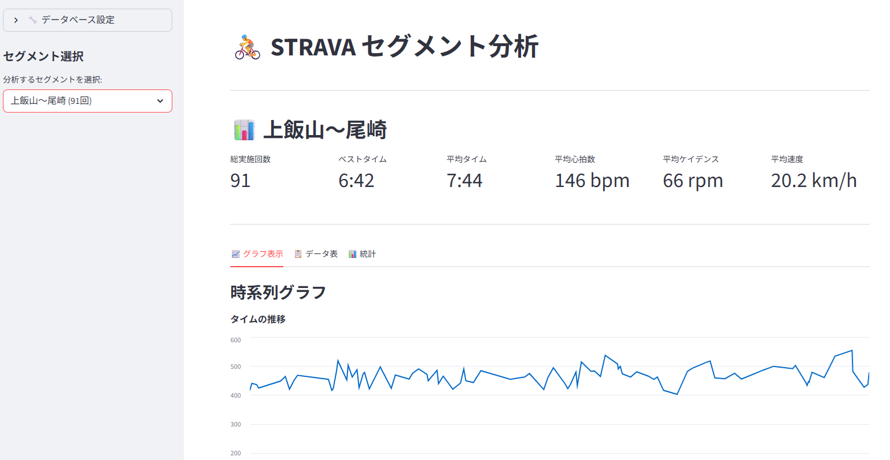

## start PostgreSQL container
```powershell
docker-compose up -d
docker exec -it strava_postgres bash
cd /workspace
psql -U postgres -d strava -f create_tables.sql
```

## set Strava Developer Client ID and Secret Key as Environment Variables
```powershell
$Env:STRAVA_CLIENT_ID=xxxxxx
$Env:STRAVA_CLIENT_SECRET="xxxxxxxxxxxxxxxxxxxxxxxxxxxxxxxxxxxxxxxx"
```

## get the Strava API access token and set it as environment variable
```powershell
 python .\get_access_token.py
https://www.strava.com/oauth/authorize?client_id=xxxxxx&redirect_uri=http%3A%2F%2Flocalhost%3A8080%2Fauthorized&approval_prompt=auto&scope=read%2Cactivity%3Aread_all%2Cprofile%3Aread_all&response_type=code
Enter the authorization code:xxxxxxxxxxxxxxxxxxxxxxxxxxxxxxxxxxxxxxxx
access_token: xxxxxxxxxxxxxxxxxxxxxxxxxxxxxxxxxxxxxxxx
refresh_token: xxxxxxxxxxxxxxxxxxxxxxxxxxxxxxxxxxxxxxxx
expires_at: xxxxxxxxxx
```

```powershell
$env:STRAVA_ACCESS_TOKEN="xxxxxxxxxxxxxxxxxxxxxxxxxxxxxxxxxxxxxxxx"
$env:STRAVA_REFRESH_TOKEN="xxxxxxxxxxxxxxxxxxxxxxxxxxxxxxxxxxxxxxxx"
$env:STRAVA_TOKEN_EXPIRES_AT=xxxxxxxxxx
```
## save your activity data to the database
```powershell
python.exe .\store_activities.py --limit 10 --after 2025-01-01 --before 2025-08-31
```

## search database activity data
```powershell
docker exec -it strava_postgres bash
cd /workspace
psql -U postgres -d strava -f sample_activities.sql
      start_date      |            name            | distance_m | moving_time_s | elapsed_time_s | avg_hr | max_hr
----------------------+----------------------------+------------+---------------+----------------+--------+--------
 2025-08-26T21:20:39Z | Morning Ride(nakatsu-gawa) |    26763.6 |          4824 |           6167 |  128.9 |  172.0
 2025-08-25T21:04:52Z | Morning Ride               |    20558.9 |          3446 |           4868 |  137.1 |  180.0
 2025-08-24T21:19:49Z | Morning Ride(sagamigawa)   |    29624.2 |          5264 |           6421 |        |
 2025-08-23T20:28:00Z | Morning Ride(shiroyama-ko) |    43946.6 |          7446 |           9748 |  141.6 |  177.0
 2025-08-18T21:14:10Z | Morning Ride(tukui pan)    |    35492.8 |          5820 |           9023 |  134.9 |  171.0
 2025-08-16T20:38:13Z | Morning Ride (miyagase)    |    54640.1 |          8904 |          10379 |  137.0 |  170.0
 2025-08-14T21:01:03Z | Morning Ride (miyagase)    |    55500.5 |          9300 |          11349 |  132.3 |  160.0
```

## launch the application
```powershell
streamlit run .\view_segment_efforts.py

Start-Process streamlit -ArgumentList "run", ".\view_segment_efforts.py"
```

